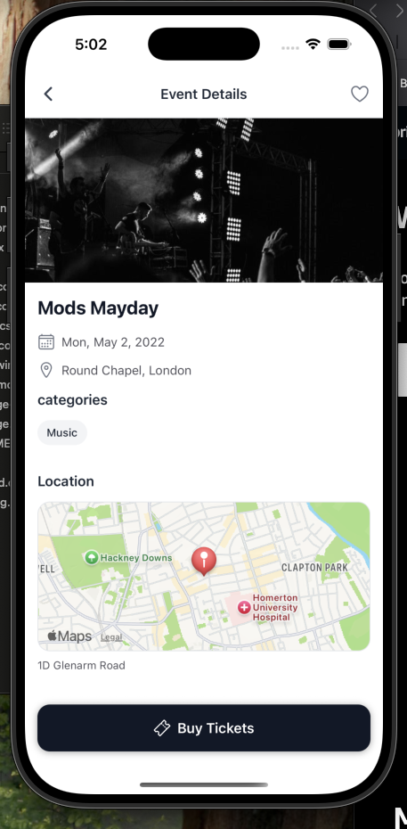
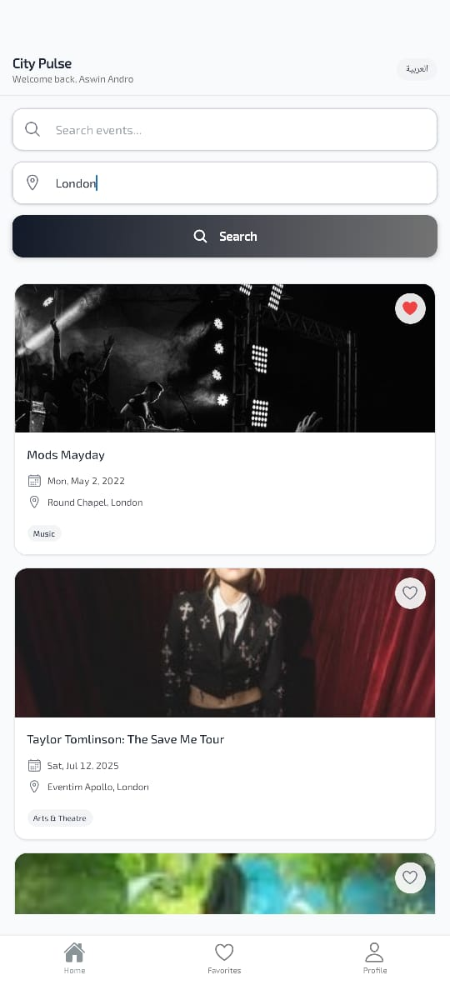
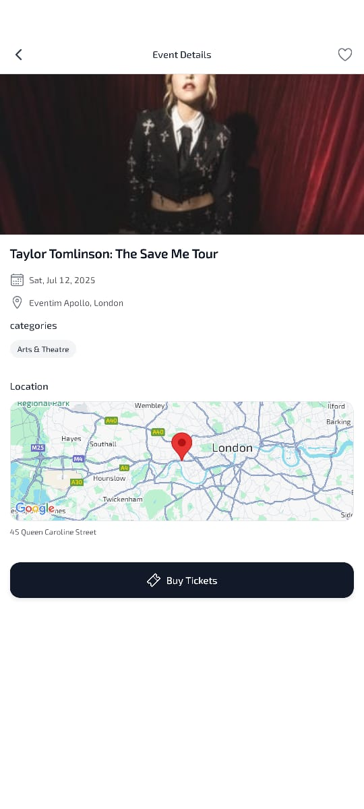

# City Pulse - Local Events Explorer

A comprehensive React Native application built with **Expo SDK 53** for discovering and exploring local events with bilingual support, Firebase authentication, and local data persistence.

## 🚀 Features

### Core Functionality
- **Event Search**: Search events by keyword and city using Ticketmaster Discovery API
- **Event Details**: Detailed event information with map preview and ticket purchasing
- **Favorites System**: Save and manage favorite events with local storage (AsyncStorage)
- **User Authentication**: Firebase Auth with biometric login support
- **Bilingual Support**: Full English/Arabic localization with RTL layout support
- **Offline Support**: Local data persistence with sample data seeding

### Technical Architecture
- **Bridge Pattern**: Common bridging folder for business logic and hooks
- **Local Storage**: AsyncStorage for all user data (favorites, search history, preferences)
- **Firebase Auth Only**: Authentication handled by Firebase, data stored locally
- **Sample Data Seeding**: Pre-populated events for offline functionality
- **Optimized Performance**: Lazy loading, memoization, and efficient state management

## 🏗️ Architecture

\`\`\`
src/
├── bridge/                 # Common bridging layer
│   ├── providers/         # Context providers (Auth, Data, Language)
│   ├── services/          # Business logic services
│   ├── hooks/             # Custom hooks
│   └── types/             # TypeScript definitions
├── components/            # Reusable UI components
├── screens/               # Screen components
├── navigation/            # Navigation configuration
└── i18n/                  # Internationalization
\`\`\`

## 📱 Local Data Storage Schema

### AsyncStorage Keys Structure:
\`\`\`typescript
// User Profile
user_{uid}: UserProfile

// User Favorites
favorites_{uid}: Event[]

// Search History
search_history_{uid}: string[]

// App Settings
app_settings: AppSettings

// Sample Events (Seeded Data)
sample_events: Event[]

// App Metadata
app_metadata: { version, lastSeeded, dataVersion }
\`\`\`

### User Profile Structure:
\`\`\`typescript
interface UserProfile {
  uid: string
  email: string
  displayName: string
  createdAt: string
  lastLoginAt: string
  preferences: {
    language: string
    notifications: boolean
    theme: "light" | "dark"
  }
  stats: {
    eventsViewed: number
    favoriteEvents: number
    searchCount: number
  }
}
\`\`\`

## 🛠️ Technology Stack

| Layer | Technology |
|-------|------------|
| **Framework** | React Native (Expo SDK 53) |
| **Navigation** | Expo Router |
| **State Management** | React Context API + Bridge Pattern |
| **Styling** | NativeWind (Tailwind CSS) |
| **Animations** | React Native Reanimated |
| **Authentication** | Firebase Auth |
| **Local Storage** | AsyncStorage |
| **Maps** | React Native Maps |
| **Localization** | i18next |
| **HTTP Client** | Axios |
| **Biometrics** | Expo Local Authentication |

## 🚀 Getting Started

### Prerequisites
- Node.js (v18 or higher)
- Expo CLI
- iOS Simulator or Android Emulator
- Firebase project (Auth only)
- Ticketmaster API key (optional)

### Installation

1. **Clone the repository**
   \`\`\`bash
   git clone https://github.com/aswinandro/city-pulse-app.git
   cd city-pulse-app
   \`\`\`

2. **Install dependencies**
   \`\`\`bash
   npm install
   \`\`\`

3. **Environment Setup**
   Copy `.env.example` to `.env` and configure:
   \`\`\`env
   EXPO_PUBLIC_FIREBASE_API_KEY=your_firebase_api_key
   EXPO_PUBLIC_FIREBASE_AUTH_DOMAIN=your_project.firebaseapp.com
   EXPO_PUBLIC_FIREBASE_PROJECT_ID=your_project_id
   EXPO_PUBLIC_TICKETMASTER_API_KEY=your_ticketmaster_api_key
   \`\`\`

4. **Start the development server**
   \`\`\`bash
   npx expo start
   \`\`\`

5. **Run on device/simulator**
   - iOS: Press `i` or scan QR code with Camera app
   - Android: Press `a` or scan QR code with Expo Go app

## 🔧 Configuration

### Firebase Setup (Auth Only)
1. Create a Firebase project at [Firebase Console](https://console.firebase.google.com)
2. Enable Authentication with Email/Password
3. Add your configuration to the `.env` file
4. **Note**: We only use Firebase for authentication, all user data is stored locally

### Sample Data
The app automatically seeds sample events on first launch:
- 3 sample events with different categories
- Realistic event data with images, venues, and pricing
- Offline functionality without API dependency

## 📊 Data Flow

1. **Authentication**: Firebase Auth → Local user profile storage
2. **Events**: API/Sample data → Local display → No persistence
3. **Favorites**: Local AsyncStorage per user
4. **Search History**: Local AsyncStorage per user
5. **User Preferences**: Local AsyncStorage per user

## 📊 Screnshots

| iPhone Simultor                            | Home Screen                            | Event Details                                      |
| ------------------------------------------ | -------------------------------------- | -------------------------------------------------- |
|  |    |         |

## 🧪 Testing

\`\`\`bash
# Run unit tests
npm test

# Run E2E tests (if configured)
npm run test:e2e
\`\`\`

## 📦 Building for Production

### Android
\`\`\`bash
npx expo build:android
\`\`\`

### iOS
\`\`\`bash
npx expo build:ios
\`\`\`

## 🚀 Deployment

The app can be deployed using:
- **Expo Application Services (EAS)** for app store distribution
- **Expo Go** for development and testing
- **Standalone builds** for enterprise distribution

## 🔒 Security Features

- Firebase Authentication with secure token management
- Biometric authentication support
- Local data encryption (AsyncStorage)
- Secure API key management
- Input validation and sanitization

## 🌍 Internationalization

- English and Arabic language support
- RTL layout for Arabic
- Dynamic language switching
- Persistent language preferences

## 📈 Performance Optimizations

- Lazy loading of components
- Image caching and optimization
- Efficient state management with Context API
- Memoized components and callbacks
- Optimized bundle size with tree shaking

## 🤝 Contributing

1. Fork the repository
2. Create a feature branch (`git checkout -b feature/amazing-feature`)
3. Commit your changes (`git commit -m 'Add amazing feature'`)
4. Push to the branch (`git push origin feature/amazing-feature`)
5. Open a Pull Request

## 📄 License

This project is licensed under the MIT License - see the [LICENSE](LICENSE) file for details.

**Built with ❤️ using React Native, Expo SDK 53, and modern development practices**
